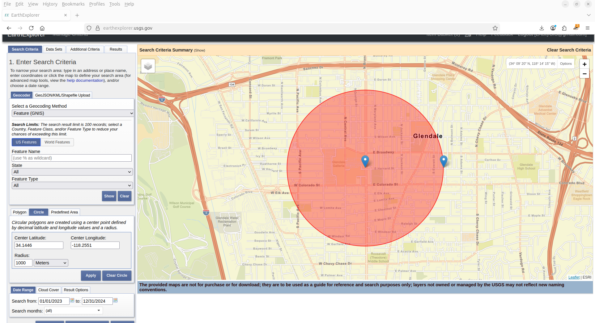
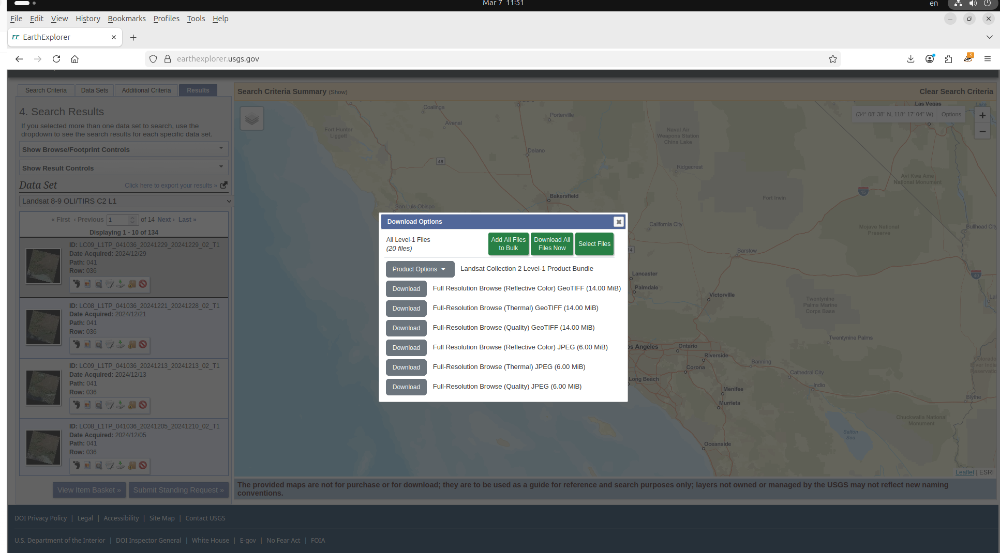
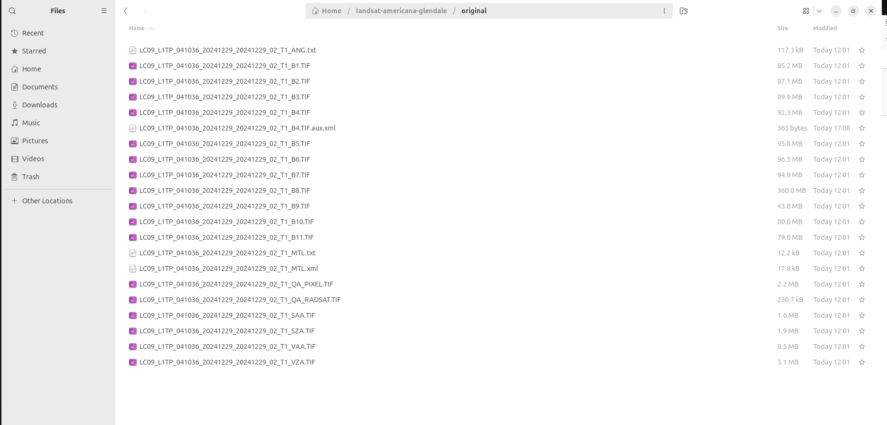
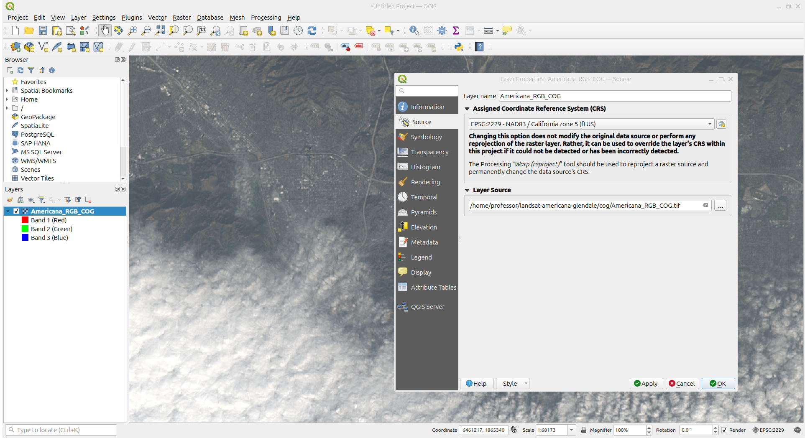

# 🌎 **Landsat Americana at Brand - Glendale, CA**

[](https://opensource.org/licenses/MIT)
[](https://gdal.org)
[](https://qgis.org)
[](https://www.usgs.gov/landsat-missions/landsat-9)
[](https://earthexplorer.usgs.gov)

> **This repository contains pure GDAL commands run on Ubuntu Linux to process Landsat 9 imagery for The Americana at Brand in Glendale, California, reproject to NAD83 / California Zone 5 (EPSG:2229) , and create Cloud Optimized GeoTIFFs.**

---
<br> Good Links for self study:<br /> 
<br> Link 1: https://gdal.org/en/stable/drivers/raster/cog.html <br />
<br> Link 2: https://guide.cloudnativegeo.org/cloud-optimized-geotiffs/cogs-overview_resampling.html<br />
<br> Link 3: https://geoexamples.com/other/2019-02-08-cog-tutorial/<br />


💻 System Requirements

    Operating System: Ubuntu Linux (20.04 or later)
    GDAL Version: 3.4+ (install with sudo apt-get install gdal-bin)
    Storage: At least 10GB free space
    RAM: 8GB recommended
    

## 📋 **Table of Contents**
- Project Overview
- 📍 Location
- 🛰️ 📥 Download Data from USGS
  <br> Google Drive link to download all files(Landsat downloaded files, scripts,..): <br />
  <br> https://drive.google.com/drive/folders/1UTRDwe3cdAeJjcBnPmIe6bW0D6pMGyMD?usp=sharing <br />
  <br><br />
- 📊 Scene Details
- 🚀 Quick Start
- 🔄 Reprojection Workflow
- 🌈 Creating RGB GeoTIFF(a GeoTIFF file that contains 3 bands)
  Band 1: 🔴 Red channel
  Band 2: 🟢 Green channel
  Band 3: 🔵 Blue channel 
- ☁️ Creating Cloud Optimized GeoTIFF (COG)




## 🎯 **Project Overview**

This repository provides a complete, step-by-step guide to:

✅ Download **Landsat 9** imagery for **The Americana at Brand** in Glendale, CA  
✅ Reproject from **UTM Zone 11N (EPSG:32611)** to **NAD83 / California Zone 5 (EPSG:2229)**  
✅ Create **Cloud Optimized GeoTIFFs (COGs)** for fast streaming  
✅ Build **RGB color composites** with correct band ordering  
✅ Generate both **VRT (virtual)** and **physical GeoTIFF** files  
✅ Visualize in **QGIS** with proper projection verification  

---

## 📍 **Location**

<div align="center">

| **Parameter** | **Value** |
|:-------------:|:---------:|
| **Place** | The Americana at Brand, Glendale, CA |
| **Latitude** | `34.1446° N` |
| **Longitude** |`-118.2551° W` |
| **Radius** | `1000 meters` |

</div>

---

## 🛰️ **Data Source**

This project uses **Landsat 8-9 OLI/TIRS Collection 2 Level-1** data from the [USGS EarthExplorer](https://earthexplorer.usgs.gov).

Landsat files  

Original Landsat files  

### Selection Hierarchy
┌─────────────────────────────────────────────────────────┐
│ USGS EarthExplorer │
└─────────────────────────────────────────────────────────┘
│
▼
┌─────────────────────────────────────────────────────────┐
│ Landsat │
└─────────────────────────────────────────────────────────┘
│
▼
┌─────────────────────────────────────────────────────────┐
│ Landsat Collection 2 │
└─────────────────────────────────────────────────────────┘
│
▼
┌─────────────────────────────────────────────────────────┐
│ Level-1 │
└─────────────────────────────────────────────────────────┘
│
▼
┌─────────────────────────────────────────────────────────┐
│ Landsat 8-9 OLI/TIRS C2 L1 ← YOU ARE HERE! │
└─────────────────────────────────────────────────────────┘
│
▼
┌─────────────────────────────────────────────────────────┐
│ LC09_L1TP_041036_20241229_20241229_02_T1 │
│ ┌──────────┬──────────┬──────────┬──────────┬────────┐ │
│ │ B1.TIF │ B2.TIF │ B3.TIF │ B4.TIF │ B5.TIF │ │
│ │(Coastal) │ (Blue) │ (Green) │ (Red) │ (NIR) │ │
│ ├──────────┼──────────┼──────────┼──────────┼────────┤ │
│ │ B6.TIF │ B7.TIF │ B8.TIF │ B9.TIF │...more│ │
│ │ (SWIR1) │ (SWIR2) │ (Pan) │ (Cirrus) │ │ │
│ └──────────┴──────────┴──────────┴──────────┴────────┘ │
└─────────────────────────────────────────────────────────┘


### File Identifier Breakdown

| **Component** | **Value** | **Meaning** |
|:-------------:|:---------:|:-----------:|
| **Satellite** | `LC09` | Landsat 9 |
| **Level** | `L1TP` | Level-1 Terrain Precision |
| **Path/Row** | `041036` | Path 041, Row 036 (Glendale area) |
| **Acquisition** | `20241229` | December 29, 2024 |
| **Collection** | `02` | Collection 2 |
| **Tier** | `T1` | Tier 1 (highest quality) |

---

## 📊 **Scene Details**

<div align="center">

| **Property** | **Value** |
|:------------:|:---------:|
| **Satellite** | 🛰️ Landsat 9 |
| **Scene ID** | `LC09_L1TP_041036_20241229_20241229_02_T1` |
| **Acquisition Date** | 📅 December 29, 2024 |
| **Path / Row** | 041 / 036 |
| **Cloud Cover** | ☁️ ~2.3% |
| **Original CRS** | UTM Zone 11N (EPSG:32611) |
| **Original Units** | Meters |
| **Target CRS** | NAD83 / California Zone 5 (EPSG:2229) |
| **Target Units** | US Survey Feet |

</div>

### Bands Used for RGB Composite

| **Band** | **Channel** | **File** | **Purpose** |
|:--------:|:-----------:|:--------:|:-----------:|
| **Band 2** | 🔵 Blue | `*_B2.TIF` | RGB Blue channel |
| **Band 3** | 🟢 Green | `*_B3.TIF` | RGB Green channel |
| **Band 4** | 🔴 Red | `*_B4.TIF` | RGB Red channel |

---

## 📁 **Repository Structure**

### File Identifier Breakdown

| **Component** | **Value** | **Meaning** |
|:-------------:|:---------:|:-----------:|
| **Satellite** | `LC09` | Landsat 9 |
| **Level** | `L1TP` | Level-1 Terrain Precision |
| **Path/Row** | `041036` | Path 041, Row 036 (Glendale area) |
| **Acquisition** | `20241229` | December 29, 2024 |
| **Collection** | `02` | Collection 2 |
| **Tier** | `T1` | Tier 1 (highest quality) |

---

## 📊 **Scene Details**

<div align="center">

| **Property** | **Value** |
|:------------:|:---------:|
| **Satellite** | 🛰️ Landsat 9 |
| **Scene ID** | `LC09_L1TP_041036_20241229_20241229_02_T1` |
| **Acquisition Date** | 📅 December 29, 2024 |
| **Path / Row** | 041 / 036 |
| **Cloud Cover** | ☁️ ~2.3% |
| **Original CRS** | UTM Zone 11N (EPSG:32611) |
| **Original Units** | Meters |
| **Target CRS** | NAD83 / California Zone 5 (EPSG:2229) |
| **Target Units** | US Survey Feet |

</div>

### Bands Used for RGB Composite

| **Band** | **Channel** | **File** | **Purpose** |
|:--------:|:-----------:|:--------:|:-----------:|
| **Band 2** | 🔵 Blue | `*_B2.TIF` | RGB Blue channel |
| **Band 3** | 🟢 Green | `*_B3.TIF` | RGB Green channel |
| **Band 4** | 🔴 Red | `*_B4.TIF` | RGB Red channel |

---




---

## 🚀 **Quick Start**

### Prerequisites

```bash
# Install required software
sudo apt-get update
sudo apt-get install -y gdal-bin python3-gdal qgis

# Verify installations
gdalinfo --version
qgis --version
